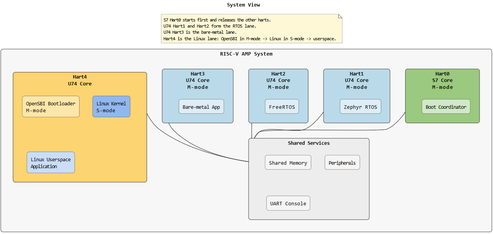

# Examples

This section provides worked examples showing the complete HALO workflow from model definition through application integration.

## System Architecture Overview

The HALO framework follows a layered architecture where multiple cores/components running on different platforms communicate through well-defined interfaces and protocols.



*Example: RISC-V AMP System with Linux, FreeRTOS, Zephyr, and Bare-metal cores*

This image shows a real-world RISC-V system architecture:
- **Hart4** (Yellow): Linux system with kernel and userspace application
- **Hart3, Hart2, Hart1** (Blue): Real-time U74 cores running bare-metal firmware, FreeRTOS, and Zephyr
- **Hart0** (Green): S7 core running boot coordinator/bootloader (not involved in application communication)
- **Shared Services**: Common shared memory, peripherals, and UART console accessible to all cores

HALO configures communication channels between the application cores (Hart4, Hart3, Hart2, Hart1) and generates platform-specific code for each.

## Example 1: Step-by-Step Workflow

### Step 1: Define Your System Model (HADL)

Create a `system.adl` file describing all components and connections aligned with the RISC-V AMP architecture:

```adl
HALOFramework {
    components {
        Hart4 : Component { Type: Application,  Platform: Linux,     Function: GeneralProcessing }
        Hart3 : Component { Type: Application,  Platform: BareMetal, Function: RealTimeProcessing }
        Hart2 : Component { Type: Application,  Platform: FreeRTOS,  Function: RealTimeProcessing }
        Hart1 : Component { Type: Application,  Platform: Zephyr,    Function: RealTimeProcessing }
    }

    connections {
        connection LinuxToBare {
            from Hart4 to Hart3
            interface: ControlInterface
            profile: sharedMemoryProfile1
        }
        
        connection LinuxToFreeRTOS {
            from Hart4 to Hart2
            interface: SensorInterface
            profile: sharedMemoryProfile1
        }
        
        connection LinuxToZephyr {
            from Hart4 to Hart1
            interface: StatusInterface
            profile: sharedMemoryProfile1
        }
        
        connection BareToRTOS {
            from Hart3 to Hart2
            interface: DataInterface
            profile: sharedMemoryProfile2
        }
        
        connection FreeRTOSToZephyr {
            from Hart2 to Hart1
            interface: CoordinationInterface
            profile: sharedMemoryProfile2
        }
    }
}
```

### Step 2: Define Data Types (IDDL)

Create `halo_interface_data.iddl` with reusable data structures:

```iddl
dataStructures {
    SensorData {
        integer sensorId
        unsigned int timestamp
        byte payload[256]
    }
    
    ControlCommand {
        byte commandCode
        integer parameter1
        integer parameter2
    }
    
    SystemStatus {
        byte statusCode
        integer cpuLoad
        integer memoryUsed
    }
}
```

### Step 3: Define Interfaces (IDL)

Create `halo_interfaces.idl` specifying what data flows in each interface:

```idl
include halo_interface_data.iddl

interface ControlInterface {
    access {
        read {
            ControlCommand
        }
        write {
            SystemStatus
        }
    }
    integrity {
        crc32 {
            ControlCommand
        }
    }
}

interface SensorInterface {
    access {
        read {
            SensorData
        }
        write {
            SystemStatus
        }
    }
    integrity {
        crc32 {
            SensorData
        }
    }
}

interface StatusInterface {
    access {
        read {
            SystemStatus
        }
        write {
            SystemStatus
        }
    }
}

interface DataInterface {
    access {
        read {
            SensorData
            ControlCommand
        }
        write {
            SensorData
        }
    }
    integrity {
        crc16 {
            SensorData
        }
    }
}

interface CoordinationInterface {
    access {
        read {
            ControlCommand
        }
        write {
            ControlCommand
        }
    }
}
```

### Step 4: Define Hardware Mapping Profiles (HMML)

Create `halo_hml_profiles.hmml` if you don't want to use a built-in HALO profile SharedMemory; If you want to use SharedMemory (--include-stdlib-profiles) you can override its parameters but cannot redefine it:

```hmml
Profiles {
    <your shared memory profile>
}
```

### Step 5: Instantiate Profiles (HML)

Create `halo_hml_instances.hml` mapping profiles to connections, for this example we will use  built-in HALO profile SharedMemory but override some attributes.

```hml
Profiles {
    SharedMemory sharedMemoryProfile1 {
        memSize: 64MB
        baseAddress: 0x80000000
    }
    
    SharedMemory sharedMemoryProfile2 {
        memSize: 32MB
        baseAddress: 0x84000000
    }
}
```


built-in HALO profile SharedMemory:
```hml
    SharedMemory {
        memSize: 64MB
        baseAddress: 0x80000000
        cacheable: True
        policy: WriteBack
        coherence: Software
        syncType: AcquireRelease
        permissions: RW
        priority: High
        syncBlocking: True
        syncPrimitive: mutex
    }
```

### Step 6: Compose the Model

Run the HALO composer to validate and unify all inputs. We add   --include-stdlib-profiles as we are using built-in HALO profile SharedMemory

```bash
halo compose \
  --hadls-root ./path_to_hadls \
  --output-dir ./halo_out \
  --include-stdlib-profiles
```

Optional: extend model value domains with user types.

Example `user_types.json`:

```json
{
        "componentType": ["MyType", "MyType2"],
        "componentPlatform": ["MyPlatform", "MyPlatform2"],
        "componentFunction": ["MyFunction", "MyFunction2"]
}
```

Supported commands:

```bash
python -m halo compose --hadls-root path\to\hadls --output-dir path\to\out --user-types path\to\user_types.json
python -m halo compose --from-xmi path\to\model.uml --output-dir path\to\out --user-types path\to\user_types.json
```

You can use this to add custom component type/platform/function values into the unified model without changing HALO source code.

This produces:
- `halo_unified_model.json` - unified system model
- UML/XMI exports for review
- Analysis reports validating consistency

### Step 7: Generate Code

Before generating code, ensure you have platform and protocol generators available.

For protocol generator:

- Use HALO's built-in standard library profiles (SharedMemory, Blackboard, EventChannel), compose with `--include-stdlib-profiles` flag (as shown in Step 6) for built-in profiles

- Create custom protocol generators, check [how to create protocol generator](#creating-a-custom-protocol-generator)
- Install them via pip so HALO discovers them automatically

For platform generator:

- Create custom platform generators for platform-specific code generation, check [how to create platform generator](#creating-a-custom-platform-generator)

- Install them via pip so HALO discovers them automatically

For this example, we proceed with built-in profiles. Generate platform and protocol-specific implementations:

```bash
halo generate \
  --composer-output-dir ./halo_out \
  --output-dir ./generated
```

This produces platform-specific packages:
- `Hart4_linux/` - Linux platform code (Hart4)
- `Hart2_freertos/` - FreeRTOS platform code (Hart2)
- `Hart1_zephyr/` - Zephyr platform code (Hart1)
- `Hart3_baremetal/` - Bare-metal platform code (Hart3)
- `portable/` - Common portable layer

For application integration with the generated code, see the [Integration](../Integration/) guide.

## Creating a Custom Platform Generator

Platform generators emit platform-specific initialization and integration code.

### Step 1: Scaffold the Platform Generator

```bash
halo create-generator --generator-type platform --no-interactive \
  --name my_custom_platform \
  --description "My Custom Platform Generator" \
  --author "Your Name" \
  --email "you@example.com" \
  --platform my_custom_platform \
  --output-dir ./generators
```

### Step 2: Examine the Generator Structure

```
halo-generator-my_custom_platform/
├── pyproject.toml
├── src/
│   └── halo_gen_my_custom_platform/
│       ├── __init__.py
│       ├── config.py          # Discovery metadata
│       ├── render.py          # Generation logic
│       └── templates/
│           ├── platform_init.h.j2
│           ├── platform_init.c.j2
│           └── platform_hal.h.j2
```

### Step 3: Implement config.py

Tell HALO how to discover your generator:

```python
"""Configuration for the My Custom Platform generator."""
from pathlib import Path

def get_platform_config():
    """Return platform generator configuration for HALO discovery."""
    module_dir = Path(__file__).parent
    render_module = module_dir / "render.py"

    return {
        "name": "my_custom_platform",
        "supported_protocols": ["sharedmemory", "blackboard", "eventchannel"],
        "module": str(render_module),
        "description": "My Custom Platform Generator",
    }
```

### Step 4: Implement render.py

Generate the platform-specific code:

```python
"""Rendering engine for My Custom Platform."""

def render(unified_model, output_dir, platform_name):
    """
    Generate platform initialization and HAL code.
    
    Args:
        unified_model: dict with components, connections, interfaces
        output_dir: Path to write generated files
        platform_name: str identifying this platform (e.g., "my_custom_platform")
    """
    # Filter model for this platform's components
    my_components = [c for c in unified_model['components'] 
                     if c['platform'] == platform_name]
    
    # Get connections involving these components
    my_connections = [conn for conn in unified_model['connections']
                      if any(c in conn['components'] for c in my_components)]
    
    # Generate platform initialization code
    init_code = generate_init_code(my_components, my_connections)
    (output_dir / "platform_init.c").write_text(init_code)
    
    # Generate HAL header
    hal_header = generate_hal_header(my_components, unified_model['interfaces'])
    (output_dir / "platform_hal.h").write_text(hal_header)
```

### Step 5: Create Jinja2 Templates

Template: `templates/platform_init.c.j2`


```c
#include "platform_init.h"
#include "halo_api.h"

/**
 * Initialize {{ platform }} platform
 * Sets up communication channels for {{ components|length }} component(s)
 */
void platform_{{ platform }}_init(void) {
    // Setup platform-specific hardware (GPIO, timers, interrupts)
    setup_hardware();
    
    // Initialize shared memory regions
    
    if (conn.profile == "sharedMemory") {
        setup_shared_memory(0x{{ conn.baseAddress }}, {{ conn.memSize }});
    }
    
    
    // Initialize DMA channels
    
    if (conn.profile == "DMA") {
        setup_dma_channel({{ conn.controller }}, {{ conn.channel }});
    }
    
    
    // Call HALO init
    halo_core_init_{{ platform }}();
}
```


### Step 6: Install and Use Your Generator

```bash
cd generators/halo-generator-my_custom_platform
pip install -e .
```

Now generate code for your platform:

```bash
halo generate --platform my_custom_platform --composer-output-dir ./halo_out
```

## Creating a Custom Protocol Generator

Protocol generators emit transport-specific code for communication patterns.

### Step 1: Scaffold the Protocol Generator

```bash
halo create-generator --generator-type protocol --no-interactive \
  --name my_custom_protocol \
  --description "My Custom Protocol Generator" \
  --author "Your Name" \
  --email "you@example.com" \
  --platform my_custom_protocol \
  --supported-platforms linux,freertos,zephyr \
  --output-dir ./generators
```

### Step 2: Implement Protocol Logic (render.py)

```python
"""Rendering engine for My Custom Protocol."""

def render(unified_model, output_dir, protocol_name):
    """Generate protocol-specific transport code."""
    
    # Find all connections using this protocol
    my_connections = [c for c in unified_model['connections']
                      if c['profile'] == protocol_name]
    
    for conn in my_connections:
        # Generate send/receive functions for each connection
        sender_code = generate_send_code(conn)
        receiver_code = generate_recv_code(conn)
        
        output_file = output_dir / f"{protocol_name}_{conn['name']}.c"
        output_file.write_text(sender_code + receiver_code)
```

### Step 3: Create Protocol Header Template

Template: `templates/protocol.h.j2`


```c
#ifndef {{ protocol|upper }}_H
#define {{ protocol|upper }}_H

#include "halo_types.h"
#include "halo_structs.h"

/**
 * {{ protocol }} Protocol - Custom Transport Layer
 * Supports {{ connections|length }} connection(s)
 */


// Connection: {{ conn.name }}
// From: {{ conn.from }} To: {{ conn.to }}
// Interface: {{ conn.interface }}

typedef struct {
    halo_u32_t seq_num;
    halo_u64_t timestamp;
    halo_u32_t crc;
} {{ protocol }}_{{ conn.name }}_header_t;

int {{ protocol }}_send_{{ conn.name }}(const void *data, halo_size_t len);
int {{ protocol }}_recv_{{ conn.name }}(void *data, halo_size_t *len);



#endif /* {{ protocol|upper }}_H */
```


```c
#include "halo_api.h"
#include "halo_structs.h"
#include "Linux_init.h"
```

### Step 2: Initialize HALO at Startup

```c
int main(int argc, char *argv[]) {
    // Initialize HALO communication layer
    halo_core1_init_Linux();
    
    printf("HALO initialized on Linux Core1\n");
    
    // Your application code here
    while (1) {
        process_sensor_data();
        send_commands();
        usleep(10000);  // 10ms
    }
    
    return 0;
}
```

### Step 3: Send Data Using HALO API

```c
#include "halo_api.h"

void send_sensor_data(uint32_t sensor_id, uint8_t *payload) {
    SharedData data;
    data.sensorId = sensor_id;
    data.timestamp = get_current_time();
    memcpy(data.payload, payload, sizeof(data.payload));
    
    // Send to FreeRTOS Core2 via LinuxToRTOS connection
    int result = halo_send_SharedData_LinuxToRTOS(&data);
    
    if (result == HALO_OK) {
        printf("Data sent successfully\n");
    } else {
        printf("Send failed with error code: %d\n", result);
    }
}
```

### Step 4: Receive Data Using HALO API

```c
void receive_system_status(void) {
    SystemStatus status;
    int result;
    
    // Try to receive from PL (Hardware Accelerator)
    result = halo_recv_SystemStatus_PLToLinux(&status);
    
    if (result == HALO_OK) {
        printf("Status received:\n");
        printf("  Code: 0x%02X\n", status.statusCode);
        printf("  CPU Load: %d%%\n", status.cpuLoad);
        printf("  Memory Used: %d bytes\n", status.memoryUsed);
    } else if (result == HALO_NODATA) {
        // No data available yet
        printf("No data available\n");
    } else {
        printf("Receive error: %d\n", result);
    }
}
```

### Step 5: Complete Application Example

```c
#include <stdio.h>
#include <string.h>
#include <unistd.h>
#include "halo_api.h"
#include "Linux_init.h"

typedef struct {
    uint32_t sensor_count;
    uint32_t frame_number;
} AppState;

void app_init(AppState *state) {
    state->sensor_count = 0;
    state->frame_number = 0;
    
    // Initialize HALO
    halo_core1_init_Linux();
    printf("Application initialized\n");
}

void app_process_cycle(AppState *state) {
    ControlCommand cmd;
    SystemStatus status;
    
    // Receive commands from FreeRTOS
    if (halo_recv_ControlCommand_RTOSToLinux(&cmd) == HALO_OK) {
        printf("Command received: 0x%02X\n", cmd.commandCode);
        state->sensor_count++;
    }
    
    // Receive status from accelerator
    if (halo_recv_SystemStatus_PLToLinux(&status) == HALO_OK) {
        printf("System status: CPU=%d%%, Mem=%d\n", 
               status.cpuLoad, status.memoryUsed);
    }
    
    // Send sensor data periodically
    if ((state->frame_number % 10) == 0) {
        SensorData data = {
            .sensorId = 1,
            .timestamp = state->frame_number,
        };
        strcpy((char*)data.payload, "Sensor reading from Core1");
        
        int result = halo_send_SensorData_LinuxToRTOS(&data);
        if (result != HALO_OK) {
            printf("Send error: %d\n", result);
        }
    }
    
    state->frame_number++;
}

int main(int argc, char *argv[]) {
    AppState state;
    app_init(&state);
    
    // Main application loop
    for (int i = 0; i < 1000; i++) {
        app_process_cycle(&state);
        usleep(10000);  // 10ms per cycle
    }
    
    printf("Application complete: %u frames, %u sensors\n",
           state.frame_number, state.sensor_count);
    return 0;
}
```

## Error Handling

The HALO API returns status codes:

```c
typedef enum {
    HALO_OK        = 0,   // Operation successful
    HALO_INVALID   = -1,  // Invalid parameters
    HALO_NODATA    = -2,  // No data available
    HALO_OVERFLOW  = -3,  // Buffer overflow
    HALO_UNDERFLOW = -4,  // Buffer underflow
    HALO_CRC_ERROR = -5,  // CRC check failed
    HALO_TIMEOUT   = -6,  // Operation timeout
} halo_status_t;
```

Always check return codes:

```c
int result = halo_send_SensorData_LinuxToRTOS(&data);
switch (result) {
    case HALO_OK:
        printf("Success\n");
        break;
    case HALO_CRC_ERROR:
        printf("Data integrity check failed\n");
        break;
    case HALO_OVERFLOW:
        printf("Send buffer full\n");
        break;
    default:
        printf("Unknown error: %d\n", result);
}
```

## Summary

The complete workflow is:

1. **Model**: Write ADL, IDL, IDDL, HMML/HML files describing your system
2. **Compose**: Run `halo compose` to validate and unify the model
3. **Generate**: Run `halo generate` to produce platform/protocol code
4. **Integrate**: Link generated code into your applications
5. **Initialize**: Call platform init functions at startup
6. **Communicate**: Use generated send/receive APIs in your code
7. **Deploy**: Run on all target platforms

For platform or protocol customization, create custom generators using the scaffolding tool and register them via pip entry points.
